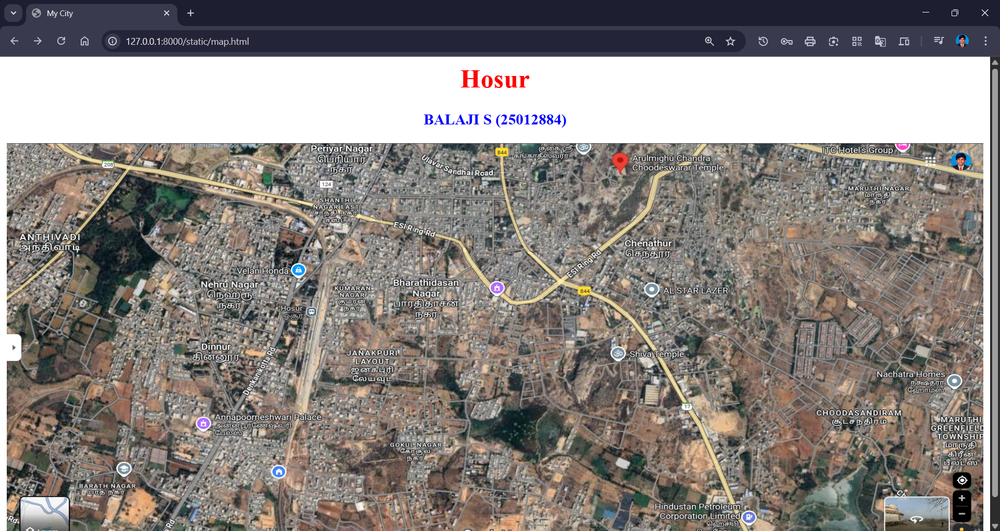
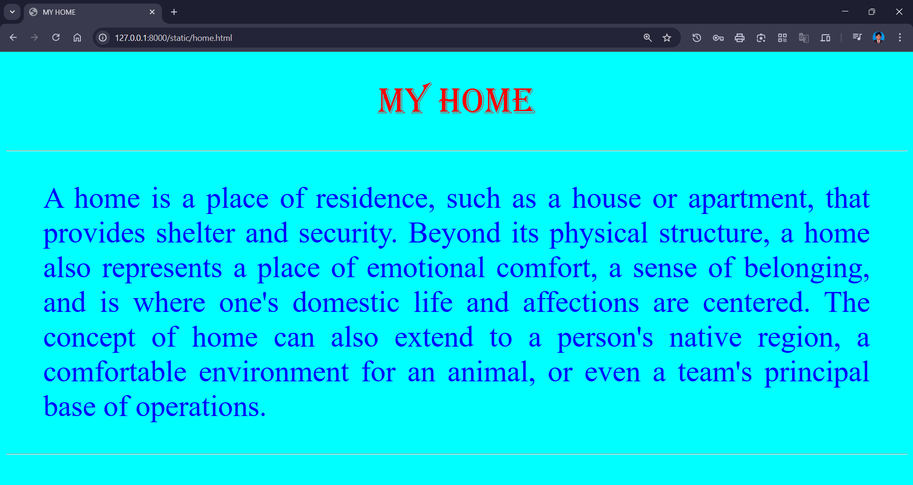
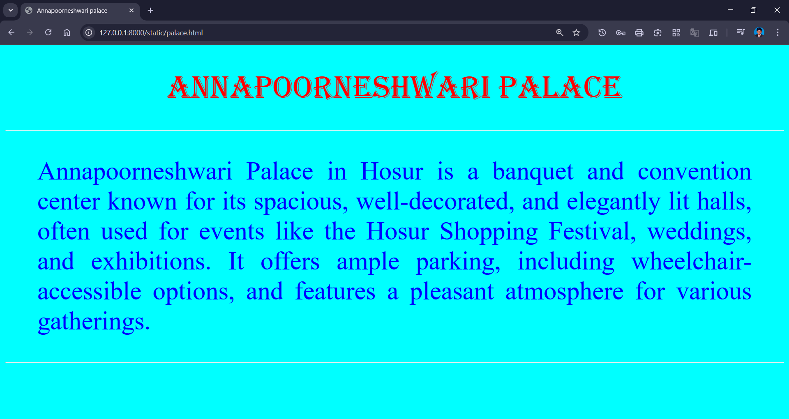
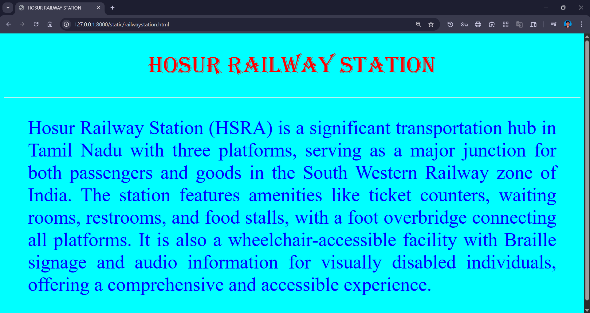
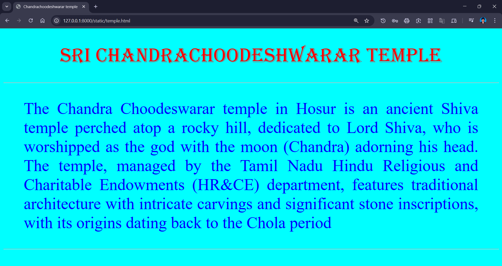
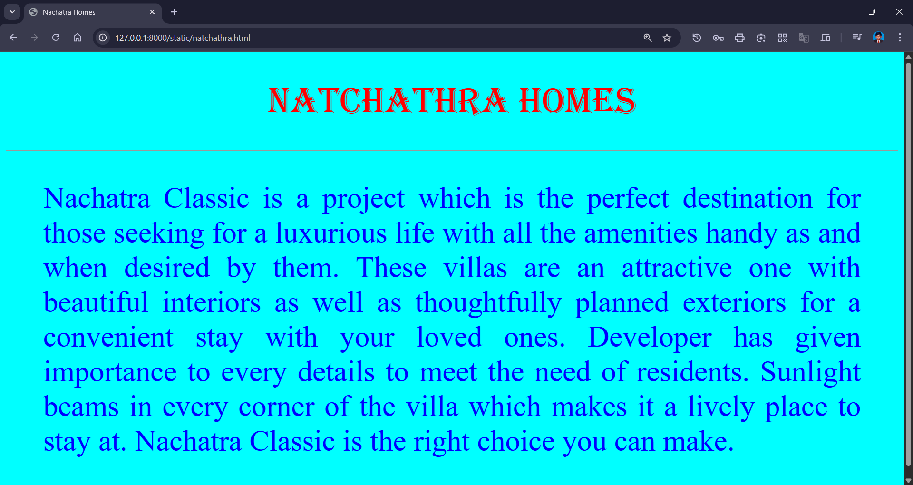

# Ex04 Places Around Me
## Date: 11-10-2025

## AIM
To develop a website to display details about the places around my house.

## DESIGN STEPS

### STEP 1
Create a Django admin interface.

### STEP 2
Download your city map from Google.

### STEP 3
Using ```<map>``` tag name the map.

### STEP 4
Create clickable regions in the image using ```<area>``` tag.

### STEP 5
Write HTML programs for all the regions identified.

### STEP 6
Execute the programs and publish them.

## CODE
```
home.html
<!DOCTYPE html>
<html>
    <head>
        <title>MY HOME</title>
        <STYLE>
            P{
                TEXT-ALIGN:JUSTIFY;
                FONT-FAMILY:LUCIDA-CALLIGRAPHY;
                FONT-SIZE:40PX;
                COLOR:BLUE;
                MARGIN-LEFT:50PX;
                MARGIN-RIGHT:50PX;
            }
            BODY{
                background-color: aqua;
            }
        </STYLE>
    </head>
    <BODY>
        <H1 ALIGN="CENTER" STYLE="FONT-FAMILY:ALGERIAN;FONT-SIZE:50PX;COLOR:RED;font-weight: lighter">MY HOME</H1>
        <HR HEIGHT="4">
            <P>A home is a place of residence, such as a house or apartment, that provides shelter and security.
                 Beyond its physical structure, a home also represents a place of emotional comfort, a sense of 
                 belonging, and is where one's domestic life and affections are centered. 
                 The concept of home can also extend to a person's native region, a comfortable environment for an animal,
                  or even a team's principal base of operations.</P>
        <HR>
    </BODY>
</html>

map.html
<html>
    <head>
        <title>My City</title>
    </head>
    <body>
        <h1 align="center">
            <font color="red"><b>Hosur</b></font>
        </h1>
        <h3 align="center">
            <font color="blue"><b>BALAJI S (25012884)</b></font>
        </h3>
        <center>
            
            <map name="MyCity">
                <area shape="rect" coords="300,400,400,500" href="home.html" title="My Home">
                <area shape="rect" coords="325,175,375,225" href="railwaystation.html" title="Railway station">
                <area shape="rect" coords="725,0,800,50" href="temple.html" title="Chandrachoodeshwarar temple">
                <area shape="rect" coords="200,325,350,375" href="palace.html" title="Annapoorneshwari palace">
                <area shape="rect" coords="1125,250,1180,300" href="natchathra.html" title="Shiva  temple">
            </map>
        </center>
    </body>
</html>

natchathra.html
<!DOCTYPE html>
<html>
    <head>
        <title>Nachatra Homes</title>
        <STYLE>
            P{
                TEXT-ALIGN:JUSTIFY;
                FONT-FAMILY:LUCIDA-CALLIGRAPHY;
                FONT-SIZE:40PX;
                COLOR:BLUE;
                MARGIN-LEFT:50PX;
                MARGIN-RIGHT:50PX;
            }
            BODY{
                background-color: aqua;
            }
        </STYLE>
    </head>
    <BODY>
        <H1 ALIGN="CENTER" STYLE="FONT-FAMILY:ALGERIAN;FONT-SIZE:50PX;COLOR:RED;font-weight: lighter">Natchathra Homes</H1>
        <HR HEIGHT="4">
            <p>Nachatra Classic is a project which is the perfect destination for those seeking for a luxurious life with all the amenities handy as and when desired by them. These villas are an attractive one with beautiful interiors as well as thoughtfully planned exteriors for a convenient stay with your loved ones. Developer has given importance to every details to meet the need of residents. Sunlight beams in every corner of the villa which makes it a lively place to stay at. Nachatra Classic is the right choice you can make.</p>
            <HR>
    </BODY>
</html>

palace.html
<!DOCTYPE html>
<html>
    <head>
        <title>Annapoorneshwari palace</title>
        <STYLE>
            P{
                TEXT-ALIGN:JUSTIFY;
                FONT-FAMILY:LUCIDA-CALLIGRAPHY;
                FONT-SIZE:40PX;
                COLOR:BLUE;
                MARGIN-LEFT:50PX;
                MARGIN-RIGHT:50PX;
            }
            BODY{
                background-color: aqua;
            }
        </STYLE>
    </head>
    <BODY>
        <H1 ALIGN="CENTER" STYLE="FONT-FAMILY:ALGERIAN;FONT-SIZE:50PX;COLOR:RED;font-weight: lighter">Annapoorneshwari palace</H1>
        <HR HEIGHT="4">
            <p>"Annapoorneshwari Palace" can refer to two different places: a temple in Horanadu, Karnataka or a venue in Hosur used for events like expos and festivals. The Horanadu temple is dedicated to the goddess Annapoorneshwari and is located in the Western Ghats. The Hosur location is a modern venue for public and private events, with no religious significance. </p>
            <HR>
    </BODY>
</html>

railwaystation.html
<!DOCTYPE html>
<html>
    <head>
        <title>HOSUR RAILWAY STATION</title>
        <STYLE>
            P{
                TEXT-ALIGN:JUSTIFY;
                FONT-FAMILY:LUCIDA-CALLIGRAPHY;
                FONT-SIZE:40PX;
                COLOR:BLUE;
                MARGIN-LEFT:50PX;
                MARGIN-RIGHT:50PX;
            }
            BODY{
                background-color: aqua;
            }
        </STYLE>
    </head>
    <BODY>
        <H1 ALIGN="CENTER" STYLE="FONT-FAMILY:ALGERIAN;FONT-SIZE:50PX;COLOR:RED;font-weight: lighter">hosur railway station</H1>
        <HR HEIGHT="4">
            <P>Hosur Railway Station (HSRA) is a significant transportation hub in Tamil Nadu with three platforms, serving as a major junction for both passengers and goods in the South Western Railway zone of India. The station features amenities like ticket counters, waiting rooms, restrooms, and food stalls, with a foot overbridge connecting all platforms. It is also a wheelchair-accessible facility with Braille signage and audio information for visually disabled individuals, offering a comprehensive and accessible experience. </P>
        <HR>
    </BODY>
</html>

temple.html
<!DOCTYPE html>
<html>
    <head>
        <title>Chandrachoodeshwarar temple</title>
        <STYLE>
            P{
                TEXT-ALIGN:JUSTIFY;
                FONT-FAMILY:LUCIDA-CALLIGRAPHY;
                FONT-SIZE:40PX;
                COLOR:BLUE;
                MARGIN-LEFT:50PX;
                MARGIN-RIGHT:50PX;
            }
            BODY{
                background-color: aqua;
            }
        </STYLE>
    </head>
    <BODY>
        <H1 ALIGN="CENTER" STYLE="FONT-FAMILY:ALGERIAN;FONT-SIZE:50PX;COLOR:RED;font-weight: lighter">sri Chandrachoodeshwarar temple</H1>
        <HR HEIGHT="4">
            <p>The Chandra Choodeswarar temple in Hosur is an ancient Shiva temple perched atop a rocky hill, dedicated to Lord Shiva, who is worshipped as the god with the moon (Chandra) adorning his head. The temple, managed by the Tamil Nadu Hindu Religious and Charitable Endowments (HR&CE) department, features traditional architecture with intricate carvings and significant stone inscriptions, with its origins dating back to the Chola period</p>
            <HR>
    </BODY>
</html>


```

## OUTPUT







## RESULT
The program for implementing image maps using HTML is executed successfully.
